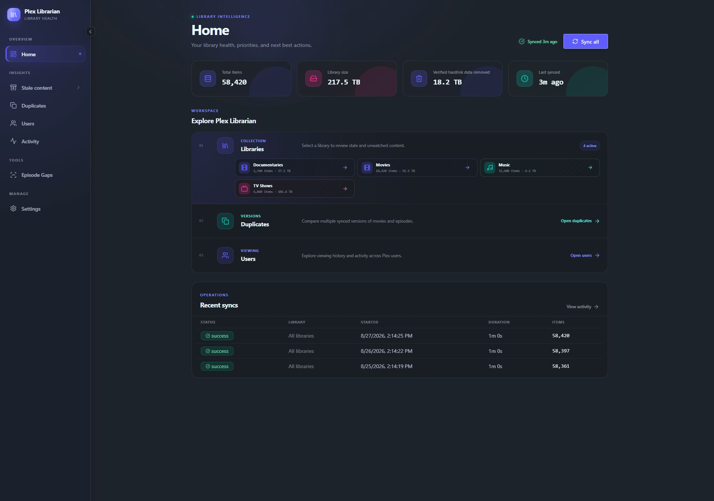

<div align="center">
  
  <h1>Plex Librarian</h1>
  <p>Find unwatched media, manage users, save bandwidth and space.</p>
  <p>
    <a href="https://github.com/BrycePearce/plex-librarian/actions/workflows/ci.yml"></a>
    <a href="https://hub.docker.com/r/edon231/plex-librarian"></a>
    <a href="https://github.com/BrycePearce/plex-librarian/pkgs/container/plex-librarian"></a>
    <a href="https://ca.unraid.net/apps/plexlibrarian-08vc6n70wshbuf"></a>
    <a href="LICENSE"></a>
  </p>
  <p>
    <a href="#installation">Install</a> ·
    <a href="#what-it-does">Features</a> ·
    <a href="#sonarr-radarr-and-qbittorrent">Integrations</a> ·
    <a href="#configuration">Configuration</a> ·
    <a href="https://github.com/BrycePearce/plex-librarian/issues">Get help</a>
  </p>
</div>



<p align="center">
  <a href="assets/screenshots/stale-analysis.png">Stale analysis</a> ·
  <a href="assets/screenshots/duplicates.png">Duplicates</a> ·
  <a href="assets/screenshots/episode-gaps.png">Episode &amp; Season Gaps</a> ·
  <a href="assets/screenshots/activity.png">Activity</a>
</p>

<p align="center"><sub>Screenshots use fictional demo data; no Plex account or user information is shown.</sub></p>

Plex Librarian is a tool for managing and maintaining Plex servers. It's
intended as a simpler alternative to heavier tools with similar functionality,
while offering some unique cleanup tools of its own. The goal is to reclaim
terabytes of storage in as few clicks as possible, using sensible defaults.

## What it does

|     | Capability                       | What you get                                                                                                                                                                                             |
| --- | -------------------------------- | -------------------------------------------------------------------------------------------------------------------------------------------------------------------------------------------------------- |
| 🧹  | **Stale media discovery**        | Find unwatched or long-unwatched movies, shows, TV seasons, and music; filter and sort by age, size, play count, and more.                                                                               |
| 💾  | **Duplicate detection**          | Surface duplicate movie and episode versions and see how much space each copy consumes.                                                                                                                  |
| 🔎  | **Episode & Season Gaps**        | Find internal episode or season-number gaps bounded by content already present in Plex, with irregular metadata called out separately.                                                                  |
| 👥  | **User insights**                | Review viewing activity, inactive accounts, and signals that may indicate account sharing, including a historical risk trend for each user.                                                              |
| 🔗  | **Sonarr & Radarr coordination** | Remove a title through the app that manages it, preventing an immediate re-download. Multiple instances are supported.                                                                                   |
| 🌱 | **Current-location deletion** | Remove selected Plex/Arr media and optionally verified current qBittorrent jobs and payloads. Unselected media and shared downloads stay protected. |

## Installation

### Unraid

[Open Plex Librarian in Community Apps](https://ca.unraid.net/apps/plexlibrarian-08vc6n70wshbuf),
or search for **Plex Librarian** from the **Apps** tab. Keep the defaults, select
**Apply**, then open the web UI from the Docker page and choose **Sign in with
Plex**. Plex Librarian discovers your server and starts its first sync.

Ordinary deletion needs only the app-data volume. Plex, Sonarr/Radarr and qBittorrent
use their own mounts and permissions. In **Media connections**, enable the optional
host discovery helper to check container mappings and refresh reusable storage relationships.
Optional local-access setup is not part of the single-host MVP.

Connect qBittorrent using its Web UI address and credentials; no manual path entry
is required in connection settings. Existing path overrides remain visible as
read-only diagnostics and survive credential edits. For unresolved storage layouts,
review **Host discovery** and the affected deletion preview. Connection health alone
does not establish deletion eligibility.

### Docker Compose

Create a `compose.yml` file:

```yaml
services:
  plex-librarian:
    image: edon231/plex-librarian:latest
    container_name: plex-librarian
    ports:
      - "8288:8080"
    volumes:
      - plex-librarian-data:/data
    restart: unless-stopped

volumes:
  plex-librarian-data:
```

Start the container, open `http://<docker-host>:8288`, and choose **Sign in with
Plex**:

```bash
docker compose up -d
```

Images are published for AMD64 and ARM64 to
[Docker Hub](https://hub.docker.com/r/edon231/plex-librarian) and
[GitHub Container Registry](https://github.com/BrycePearce/plex-librarian/pkgs/container/plex-librarian).
Use `edon231/plex-librarian:latest` for the newest stable release, or pin a full
version such as `edon231/plex-librarian:0.1.0` for predictable upgrades. The
equivalent GHCR image is `ghcr.io/brycepearce/plex-librarian`. The `edge` tag
tracks the latest successful build from `main` and may contain unreleased
changes.

## Sonarr, Radarr, Seerr, and qBittorrent

### Automatic setup on one Docker host

For the MVP, run Plex and connected services on one native Linux Docker/Unraid
host. Install the optional host helper once using the
[installation guide](deploy/discovery/README.md), then choose **Enable host
discovery** in Media connections. Existing installs should follow the
[upgrade guide](deploy/discovery/UPGRADING.md). Reconnecting a service or updating
Librarian alone does not install the helper.

Before pairing, review the administrator-access warning, check the initially
unchecked acknowledgement, then choose **Confirm enable discovery**. Cancel makes
no pairing request. This acknowledgement does not grant Docker access: installing
the helper already does. Disabling discovery does not stop the helper; stop it and
disable its autostart in Docker/Unraid to withdraw that access.

Discovery derives mappings from container configuration, including different
container paths. New connections require no manually entered mappings. Unsupported
or ambiguous layouts stay unavailable. Automatic setup does not require manual
mapping or local-access editors. **Discovery details** provides diagnostics, retry,
a mapping backup, and explicitly confirmed removal of old saved mappings.
Existing mappings are preserved until explicitly removed.

Connection status, discovery readiness, and selection-specific deletion eligibility
are separate. Both optional deletion destinations start unchecked. Check a fresh
preview after configuration changes; only confirmation enqueues deletion, and the
worker revalidates the accepted scope. Setup-only checks should end with Cancel.

### Connect Sonarr and Radarr

Plex Librarian can coordinate whole-title deletion with Radarr for movies and
Sonarr for TV. Arr removes the title and its files, then Plex Librarian asks
Plex to refresh the affected library.

Before anything is queued, the confirmation dialog verifies the mapped Arr
title and shows the folder it manages. Radarr's `deleteFiles` operation owns
removal of the complete title folder, including its safeguards for shared or
nested movie paths. If a library is not mapped, coordinated deletion is
refused; **Delete from Plex only** must be selected explicitly.

Open **Settings → Media connections**, add an instance with its URL and API key
(found in Sonarr/Radarr under **Settings → General → Security**), then review
**Host discovery** for automatic storage mapping. Use **Discovery details** to
inspect saved relationships or remove an old mapping after downloading a backup.

Use a URL reachable from inside the Plex Librarian container, such as
`http://192.168.1.20:8989` or `http://sonarr:8989` on a shared Docker network.
Do not use `localhost`, which points back at Plex Librarian itself.

### Remove a stale TV season

Open a TV library's **Stale analysis** page and switch **Shows** to **Seasons**.
Season age is conservative: the newest episode addition determines the added
date, and the most recent play of any episode determines the last-watched date.
This keeps one recently added or watched episode from making the whole season
look older than it is.

Whole-season removal accepts one season at a time. The confirmation preview
re-reads its exact Plex episode membership. When Sonarr coordination is
selected, Plex Librarian keeps the series, unmonitors that season's episodes,
and deletes only EpisodeFiles proven to belong entirely to the selected
season. A file shared with another season, ambiguous multi-instance ownership,
or changed path mapping blocks the operation. **Plex only** is an explicit
fallback and may allow Sonarr to download a monitored season again.

Optional qBittorrent cleanup requires verified ownership. It is offered only when every selected payload path
and the complete download job manifest can be attributed to this season.

### Current-location deletion and optional qBittorrent

For whole-item and stale-season deletion, Sonarr/Radarr and qBittorrent are
optional destinations and start unchecked. Connecting a service does not select
it for deletion. Review the selected media and destinations before confirming;
confirmation enqueues a durable operation whose worker checks the scope again.

The services delete through their own APIs and mounts. Librarian does not need
media mounts for ordinary deletion. Separate current Plex and manager copies
receive requests only when their services are selected. A torrent containing
retained episodes or unrelated files is blocked. Failed or incomplete download
inventories remain unknown, even when qBittorrent cleanup is unchecked.

Discovery refreshes after successful connection changes and while checking
readiness. Missing, stale, ambiguous or unsupported evidence blocks dependent
work. Existing manual mappings are preserved; use the
[upgrade guide](deploy/discovery/UPGRADING.md) before replacing them. A configuration
change can invalidate a preview or hold an accepted operation for attention.

**TV duplicates:** Plex-only episode-version and season cleanup can use automatic
storage evidence while protecting retained versions and current QB ownership.
Automatic Sonarr adoption and selected duplicate-QB cleanup are not covered by
this path. Existing coordination can require additional evidence and remain
unavailable. The existing Sonarr season flow prefers adoption; it is not a general
remove-and-unmonitor choice. A version retained in Plex may remain unmanaged by
Sonarr. Discovery Ready does not guarantee every duplicate action is supported.

Successful service steps are preserved during recovery. Lost or ambiguous
responses retain attempt evidence and reservations; follow the operation's
recovery guidance rather than submitting replacement requests. Logical media
size is distinct from actual disk space recovered, which is not measured.
Historical download paths and orphan filesystem cleanup are outside this flow.

Use the qBittorrent Web UI URL reachable from Librarian. Blank credentials are
appropriate only when authentication bypass explicitly trusts that host or
subnet. Private tracker passkeys are never returned to the browser.

See [helper installation, access requirements and supported scope](deploy/discovery/README.md).
Automatic discovery supports a bounded set of native Linux Docker layouts;
unsupported or ambiguous layouts remain unavailable.

## Configuration

Most settings live in the web UI. Under **Settings → Automatic sync**, you can
enable daily refreshes, choose the local-time hour and IANA time zone, and
decide whether the app catches up after being offline for more than 24 hours.
The page previews the next scheduled window, and named zones follow daylight
saving changes automatically. If a daylight-saving jump removes the chosen
local hour, that day's scheduled run is skipped.

These environment variables are available for Docker and advanced Unraid
installations:

| Variable                     | Required | Description                                                                              |
| ---------------------------- | :------: | ---------------------------------------------------------------------------------------- |
| `DB_PATH`                    |    No    | SQLite database path. Default: `/data/librarian.db`                                      |
| `PORT`                       |    No    | Container HTTP port. Default: `8080`                                                     |
| `PLEX_URL`                   |    No    | Direct Plex server URL; use with `PLEX_TOKEN` to skip the setup wizard                   |
| `PLEX_TOKEN`                 |    No    | Plex authentication token; use with `PLEX_URL`                                           |
| `QBITTORRENT_URL`            |    No    | qBittorrent Web UI URL; overrides connections saved in the web UI                        |
| `QBITTORRENT_USERNAME`       |    No    | qBittorrent Web UI username; omit only when authentication bypass trusts this container  |
| `QBITTORRENT_PASSWORD`       |    No    | qBittorrent Web UI password; omit only when authentication bypass trusts this container  |
| `LIBRARY_SYNC_CONCURRENCY`   |    No    | Maximum libraries synced in parallel. Default: `3`                                       |
| `FETCH_CONCURRENCY`          |    No    | Maximum concurrent Plex page requests per library. Default: `8`                          |
| `SYNC_STALL_TIMEOUT_MINUTES` |    No    | Abort a sync after this many minutes without progress. Default: `15`                     |
| `LOG_RETENTION_DAYS`         |    No    | Days to retain sync history and activity; use `0` to retain indefinitely. Default: `180` |

The concurrency defaults are intentionally conservative because Plex Librarian
often shares a host with Plex. Raise them only when the host has capacity to
spare.

For a bind mount instead of the Docker-managed volume shown above, map any
persistent host directory to `/data`. This makes the database easy to include
in a file-based backup routine.

Sonarr, Radarr, and Seerr are configured in the web UI so multiple instances can
be managed independently. qBittorrent can also be configured there; the
`QBITTORRENT_*` variables are power-user overrides and take precedence over
database-backed connections.

### Manual Plex configuration

Set both `PLEX_URL` and `PLEX_TOKEN` to bypass the Plex authorization wizard.
Environment variables take precedence over credentials saved through the web
UI.

Use a direct local Plex URL when possible, such as
`http://192.168.1.100:32400`. To locate a token in Plex Web, open an item's
three-dot menu, select **Get Info → View XML**, and copy the `X-Plex-Token`
parameter from the resulting URL.

## Optional Plex webhooks

Plex Pass users can configure a webhook for faster viewing-activity updates
between full syncs. In Plex Web, open **Settings → Webhooks → Add Webhook** and
enter:

```text
http://<plex-librarian-host>:8288/api/webhook/plex
```

The webhook records playback lifecycle events used for watch-state and user
activity insights. It follows the same trusted-network security model as the
rest of the application.

## Backups and security

All application data lives under `/data`, including the SQLite database, Plex
credentials, Sonarr/Radarr API keys, mappings, and activity history. Back up
this directory and treat the backup as sensitive.

Plex Librarian is designed for a trusted self-hosted network. If remote access
is required, place it behind a reverse proxy that provides authentication and
TLS.

Plex sign-in connects a Plex server; it does not authenticate callers of Librarian's
API. The optional discovery helper separately receives host-administrator-equivalent
Docker access. Its private snapshot interface reduces exposure to Librarian, but a
compromised helper image can control the host. Installing or updating it is a
privileged trust decision. Review the [access and release requirements](deploy/discovery/README.md)
before installation. Disabling discovery in the UI does not stop the helper or
revoke its Docker socket access.

## Support and contributing

Found a bug or have an idea? [Open an issue](https://github.com/BrycePearce/plex-librarian/issues).
Pull requests are welcome; please run the workspace validation command before
submitting a change.

```bash
deno task fmt       # apply the repository formatting rules
deno task verify    # formatting, lint, type-checking, tests, and production build
```

The project uses Deno `2.9.5`, matching the Docker image and CI. To catch
problems automatically before commits and pushes, install the repository's Git
hooks once after cloning:

```bash
deno task hooks:install
```

## Development transparency

AI-assisted development tools are used in this project. AI-assisted changes
are reviewed, tested, and maintained under the same standards as other
contributions. Project maintainers remain responsible for the resulting code,
documentation, and releases.

Plex Librarian is open-source software available under the [MIT License](LICENSE).
