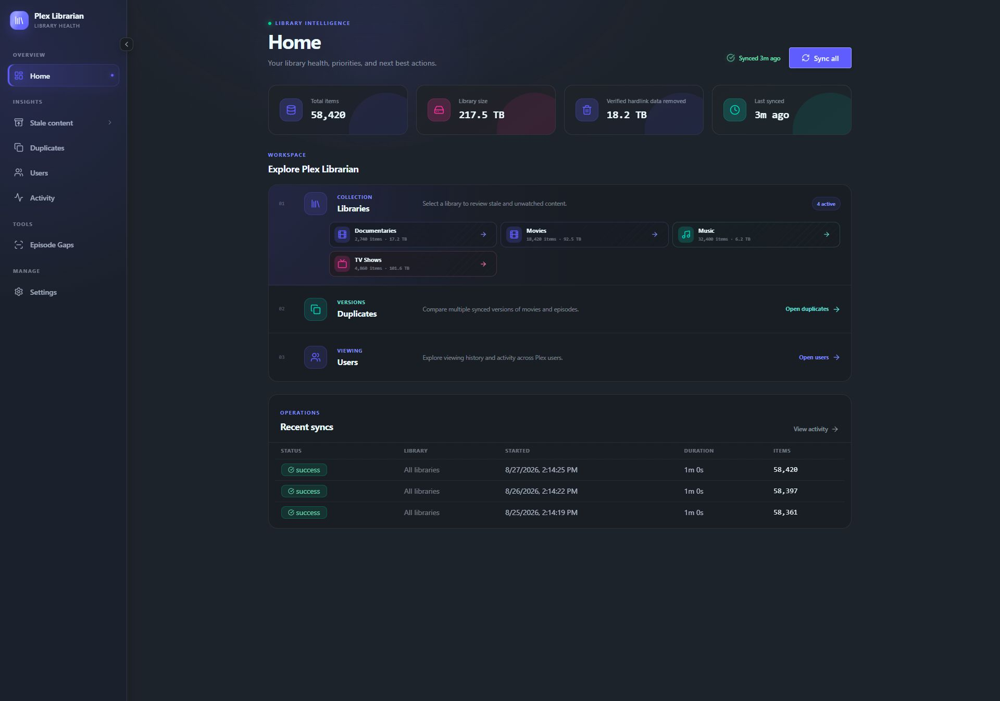

<div align="center">
  
  <h1>Plex Librarian</h1>
  <p>Find unwatched media, manage users, save bandwidth and space.</p>
  <p>
    <a href="https://github.com/BrycePearce/plex-librarian/actions/workflows/ci.yml"></a>
    <a href="https://hub.docker.com/r/edon231/plex-librarian"></a>
    <a href="https://github.com/BrycePearce/plex-librarian/pkgs/container/plex-librarian"></a>
    <a href="https://ca.unraid.net/apps/plexlibrarian-08vc6n70wshbuf"></a>
    <a href="LICENSE"></a>
  </p>
  <p>
    <a href="#installation">Install</a> ·
    <a href="#what-it-does">Features</a> ·
    <a href="#integrations">Integrations</a> ·
    <a href="#configuration">Configuration</a> ·
    <a href="https://github.com/BrycePearce/plex-librarian/issues">Get help</a>
  </p>
</div>



<p align="center">
  <a href="assets/screenshots/stale-analysis.png">Stale analysis</a> ·
  <a href="assets/screenshots/duplicates.png">Duplicates</a> ·
  <a href="assets/screenshots/episode-gaps.png">Episode &amp; Season Gaps</a> ·
  <a href="assets/screenshots/activity.png">Activity</a>
</p>

Plex Librarian helps you keep your Plex library under control: find media nobody
watches, remove redundant copies, and review user activity. Built for Docker and
Unraid, with optional Sonarr, Radarr, Seerr, and qBittorrent connections.

## What it does

| Feature | What you get |
| --- | --- |
| **Stale media discovery** | Find unwatched or long-unwatched movies, shows, seasons, and music. Sort by age, size, and play count to choose what to remove. |
| **Duplicate cleanup** | Compare movie and episode versions, see their sizes, and review suggested copies to keep or remove. |
| **Episode & season gaps** | Spot missing episode or season numbers between content already in Plex. |
| **User insights** | Review inactive users, pending invitations, viewing activity, and possible account-sharing signals. |
| **Request follow-through** | Connect Seerr to see whether users watch the movies and seasons they request. |
| **Coordinated cleanup** | Review deletions across Plex, Sonarr/Radarr, and optional qBittorrent downloads, with checks to protect retained media and shared downloads. |

## Installation

### Unraid

[Open Plex Librarian in Community Apps](https://ca.unraid.net/apps/plexlibrarian-08vc6n70wshbuf),
or search for **Plex Librarian** in the **Apps** tab. Keep the defaults, select
**Apply**, then open the web UI from the Docker page.

Choose **Sign in with Plex**, select your server, and let the first sync finish.

### Docker Compose

Save this as `compose.yml`:

```yaml
services:
  plex-librarian:
    image: edon231/plex-librarian:latest
    container_name: plex-librarian
    ports:
      - "8288:8080"
    volumes:
      - plex-librarian-data:/data
    restart: unless-stopped

volumes:
  plex-librarian-data:
```

Start it:

```bash
docker compose up -d
```

Open `http://<docker-host>:8288`, choose **Sign in with Plex**, and select your
server.

Images support AMD64 and ARM64 and are available on
[Docker Hub](https://hub.docker.com/r/edon231/plex-librarian) and
[GHCR](https://github.com/BrycePearce/plex-librarian/pkgs/container/plex-librarian)
(`ghcr.io/brycepearce/plex-librarian`). Use `latest` for stable releases, a
version tag to pin a release, or `edge` for builds from `main`.

Keep `/data` persistent; it holds the database and settings. You can replace the
named volume with a bind mount such as `/path/to/appdata:/data`. Ordinary cleanup
uses service APIs and needs no media mounts or Docker socket.

## Integrations

Open **Settings → Media connections** to add your services. Multiple instances
are supported.

- **Sonarr / Radarr:** add the service URL and API key, then assign Plex libraries.
  Include the manager in a cleanup to coordinate removal.
- **Seerr:** add the service URL and API key to enable request follow-through on
  the Users page.
- **qBittorrent:** add the Web UI URL and credentials to optionally remove verified
  downloads during cleanup.

Use addresses reachable from inside the Librarian container, such as
`http://192.168.1.20:8989` or `http://sonarr:8989` on a shared Docker network.
`localhost` points to Librarian's own container.

Sonarr/Radarr and qBittorrent cleanup start unchecked. Review the preview and
choose which services should delete content before confirming. Track results and
any steps needing attention on the Activity page.

Upgrading from the retired host-discovery helper? Follow the
[upgrade guide](deploy/discovery/UPGRADING.md) to retire the separate helper.

## Configuration

Most settings live in the web UI: daily sync scheduling with your time zone,
stale-media thresholds, user insights, and ignored titles. Add titles to
**Settings → Ignored content** to exclude them from insights and cleanup tools.

<details>
<summary>Advanced environment variables</summary>

All variables below are optional. Plex and qBittorrent environment credentials
override connections saved in the web UI.

| Variable                     | Required | Description                                                                              |
| ---------------------------- | :------: | ---------------------------------------------------------------------------------------- |
| `DB_PATH`                    |    No    | SQLite database path. Default: `/data/librarian.db`                                      |
| `PORT`                       |    No    | Container HTTP port. Default: `8080`                                                     |
| `PLEX_URL`                   |    No    | Direct Plex server URL; use with `PLEX_TOKEN` to skip the setup wizard                   |
| `PLEX_TOKEN`                 |    No    | Plex authentication token; use with `PLEX_URL`                                           |
| `QBITTORRENT_URL`            |    No    | qBittorrent Web UI URL; overrides connections saved in the web UI                        |
| `QBITTORRENT_USERNAME`       |    No    | qBittorrent Web UI username; omit only when authentication bypass trusts this container  |
| `QBITTORRENT_PASSWORD`       |    No    | qBittorrent Web UI password; omit only when authentication bypass trusts this container  |
| `LIBRARY_SYNC_CONCURRENCY`   |    No    | Maximum libraries synced in parallel. Default: `3`                                       |
| `FETCH_CONCURRENCY`          |    No    | Maximum concurrent Plex page requests per library. Default: `8`                          |
| `SYNC_STALL_TIMEOUT_MINUTES` |    No    | Abort a sync after this many minutes without progress. Default: `15`                     |
| `LOG_RETENTION_DAYS`         |    No    | Days to retain sync history and activity; use `0` to retain indefinitely. Default: `180` |

Set both `PLEX_URL` and `PLEX_TOKEN` to skip the sign-in wizard. For a token,
open an item's **Get Info → View XML** in Plex Web and copy the `X-Plex-Token`
parameter from the URL. Keep sync concurrency conservative when sharing a host
with Plex.

</details>

<details>
<summary>Optional Plex webhooks (Plex Pass)</summary>

For faster viewing-activity updates, add this URL under Plex Web's
**Settings → Webhooks**:

```text
http://<plex-librarian-host>:8288/api/webhook/plex
```

</details>

## Backups and access

Back up `/data`; it contains the database and service credentials.

Deploy on a trusted network. For remote access, use a reverse proxy with
authentication and TLS. Plex sign-in connects your server; it does not restrict
access to Librarian's web UI or API.

## Support and contributing

[Report a bug or suggest a feature](https://github.com/BrycePearce/plex-librarian/issues).
For development, use Deno `2.9.7` and run `deno task fmt` and
`deno task verify` before submitting changes.

AI-assisted contributions are reviewed, tested, and maintained by the project.
Licensed under the [MIT License](LICENSE).
